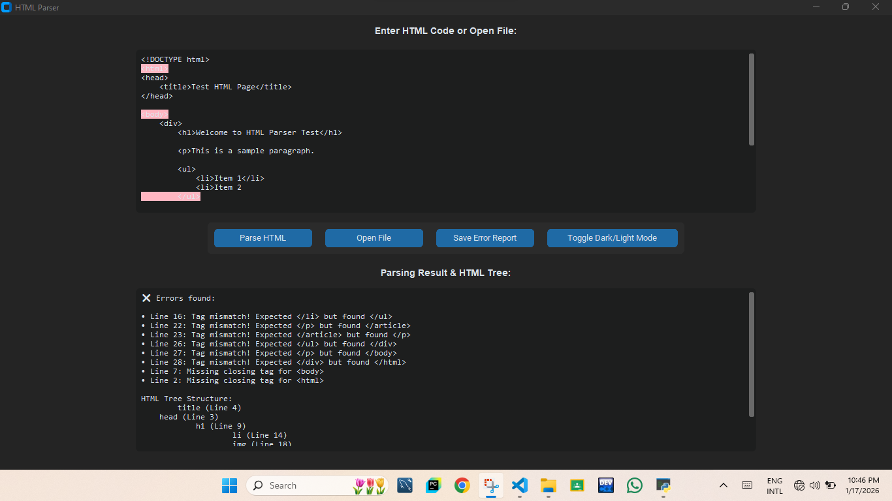
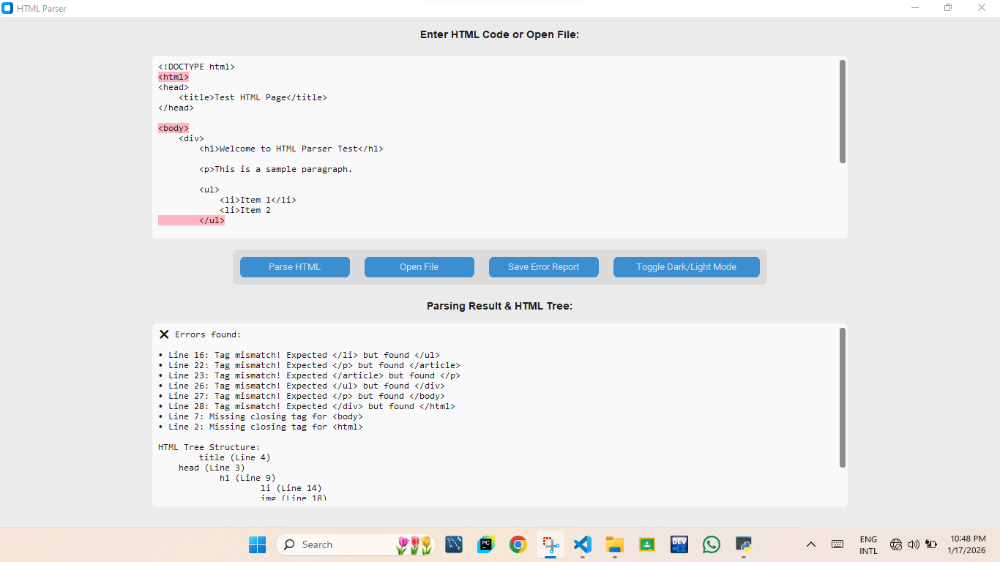

# 🧩 Stack-Based HTML Parser (Python + CustomTkinter)

An **advanced Stack-Based HTML Parser** built using **Python**, **CustomTkinter**, and **Regular Expressions**.
This desktop application provides a **graphical interface** to parse HTML files, detect syntax errors, highlight issues, and display the **HTML tree structure**.

The entire project is implemented in **a single Python file**.

---

## 🚀 Key Features

* 📂 Open and parse HTML files (`.html`, `.htm`, `.txt`)
* 📚 **Stack-based HTML parsing algorithm**
* ❌ Detects:

  * Extra closing tags
  * Missing closing tags
  * Tag mismatches
* 🌳 Displays **HTML Tree Structure** with nesting levels
* 🎨 Syntax highlighting for HTML tags
* 🚨 Highlights error lines directly in the editor
* 💾 Save error reports as `.txt` file
* 🌗 Toggle **Light / Dark mode**
* 🖥️ Modern GUI using **CustomTkinter**
* 📄 Single-file Python project

---

## 🛠️ Technologies Used

* **Python 3**
* **CustomTkinter**
* **Tkinter (filedialog)**
* **Regular Expressions (`re`)**
* **Stack Data Structure (LIFO)**

---

## 📦 Requirements

Install the required dependency before running the project:

```bash
pip install customtkinter
```

---

## 📁 Project Structure

```
stack-based-html-parser/
│
├── html_parser.py   # Main & only Python file
└── README.md
```

*(Rename `html_parser.py` according to your actual file name)*

---

## ▶️ How to Run

1. Clone the repository:

```bash
git clone https://github.com/your-username/stack-based-html-parser.git
```

2. Navigate to the project folder:

```bash
cd stack-based-html-parser
```

3. Run the application:

```bash
python html_parser.py
```

---

## 🧠 How the Stack-Based HTML Parser Works

1. HTML input is taken from:

   * Text box **OR**
   * External HTML file
2. HTML tags are extracted using **Regular Expressions**
3. Opening tags are **pushed onto a stack**
4. Closing tags **pop from the stack**
5. The parser checks:

   * Correct nesting
   * Tag mismatches
   * Missing or extra tags
6. Remaining stack elements indicate **unclosed tags**
7. A **tree structure** is generated showing nesting levels

This follows the **LIFO (Last In, First Out)** principle of stacks.

---

## 🌳 HTML Tree Structure Output

Each parsed tag is displayed with:

* Indentation based on nesting level
* Line number in source code

Example:

```
html (Line 1)
    body (Line 2)
        div (Line 3)
```

---

## 🎨 GUI Highlights

* **Pink background** highlights error lines
* **Blue color** highlights HTML tags
* Error messages displayed with line numbers
* One-click **Dark / Light mode** switch

---

## 📌 Use Cases

* Data Structures (Stack) learning
* HTML parsing concepts
* Compiler / Parsing mini-project
* Academic assignments
* Python GUI practice
* Portfolio project

---

## 🔮 Future Enhancements

* Support for self-closing tags like `<br>`
* Export HTML tree as file
* Auto-scroll to error lines
* Improved tag validation rules
* Support for attributes validation
## 🖼️ Project Screenshots

### Dark Mood


### Light Mood


---

## 🤝 Contributing

Contributions are welcome!
Feel free to fork the repository and submit a pull request.


Just tell me 😊
